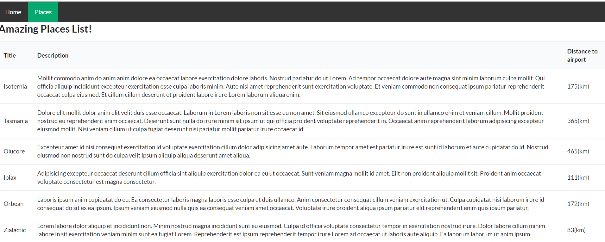

# Test project for practice and doing some task

## How to start

1. You need to install json-serve: `npm install -g json-server `
2. `yarn install`
3. `yarn start`

## Task №1

#Description

Представим, что мы разрабатывали сайт для поиска отелей. После по требованию бизнеса мы добавили поиск апартаментов,
которые предоставляет нам другое апи. После к списку отелей и апартоментов добились охотничьи домики со своей api.
Задача состатоит в получении и выводе списка всех сущностей на странице "Places". Вывести в любом удобном формате
(таблица, карточки, etc). Для удобство был добавлен semantic-ui (https://react.semantic-ui.com/);

Главная задача в написании интерфейса под каждую из сущностей и, для работы с ними на одной странице, сведению этих интерфейсов 
к общему (PlaceInterface for instance). Так же следует поправить методы в api.ts и создать конфигурацию для роутера.

Информацию о сущности, которую нужно вывести:
- title (присутствует везде);
- description (обратите внимание, что для дескрипшн для hotels свойство about);
- address (присутствует везде);
- distance (до аэропорта) в киллометрах. Присутствует везде, но для lodges информация приходит в милях. Формула для расчета:
miles* 1.60934

